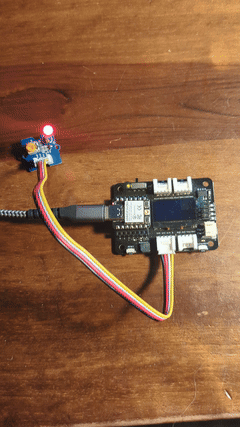
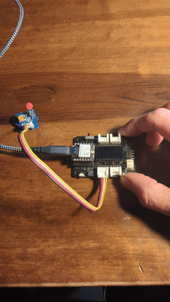
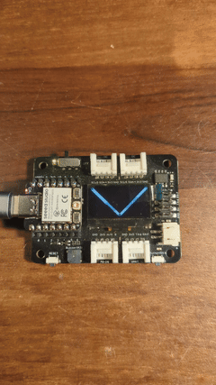
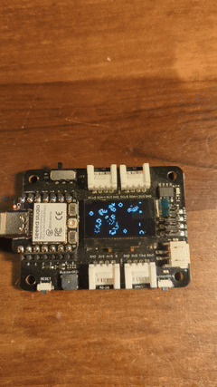
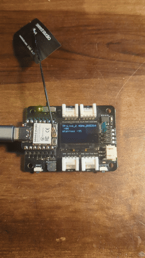
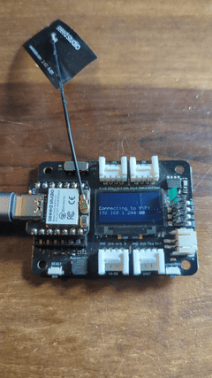
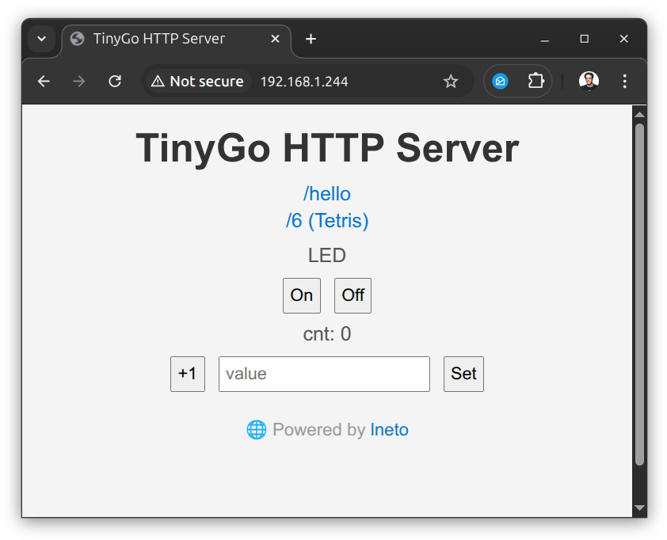
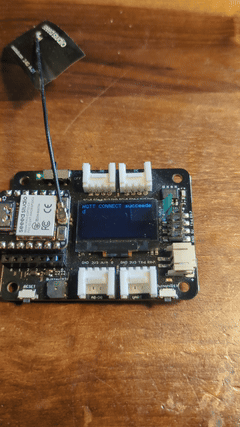

# TinyGo + XIAO

[TinyGo](https://tinygo.org/) demos and examples on [Seeedstudio](https://www.seeedstudio.com/) [XIAO-ESP32C3](https://www.seeedstudio.com/Seeed-XIAO-ESP32C3-p-5431.html) and [XIAO-ESP32S3](https://www.seeedstudio.com/XIAO-ESP32S3-p-5627.html).

## blinky



Blinks an LED. The "Hello, World" of things.

### xiao-esp32c3

```
tinygo flash -target xiao-esp32c3 -size short ./blinky
```

### xiao-esp32s3

```
tinygo flash -target xiao-esp32s3 -size short ./blinky
```

## button



Push a button, and the LED lights up.

### xiao-esp32c3

```
tinygo flash -target xiao-esp32c3 -size short ./button
```

### xiao-esp32s3

```
tinygo flash -target xiao-esp32s3 -size short ./button
```

## echo

Type into the console, and the Xiao will echo back what you typed.

### xiao-esp32c3

```
tinygo flash -target xiao-esp32c3 -size short -monitor ./echo
```

### xiao-esp32s3

```
tinygo flash -target xiao-esp32s3 -size short -monitor ./echo
```

## display



Shows the xiao controlling an OLED display with an I2C interface


### xiao-esp32c3

```
tinygo flash -target xiao-esp32c3 -size short ./display
```

### xiao-esp32s3

```
tinygo flash -target xiao-esp32s3 -size short ./display
```

## life



Shows the xiao controlling an OLED display with an I2C interface playing Conway's Game of Life

### xiao-esp32c3

```
tinygo flash -target xiao-esp32c3 -size short ./life
```

### xiao-esp32s3

```
tinygo flash -target xiao-esp32s3 -size short ./life
```

## scanner



Scans for WiFi access points and displays them on the OLED display.

### xiao-esp32c3

```
tinygo flash -target xiao-esp32c3 -size short ./scanner
```

### xiao-esp32s3

```
tinygo flash -target xiao-esp32s3 -size short ./scanner
```

## webserver





Runs a small webserver on the Xiao board. Displays the server status on the OLED display.

### xiao-esp32c3

```
tinygo flash -target xiao-esp32c3 -ldflags="-X main.ssid=YourSSID -X main.password=YourPassword" -monitor ./webserver
```

### xiao-esp32s3

```
tinygo flash -target xiao-esp32s3 -ldflags="-X main.ssid=YourSSID -X main.password=YourPassword" -monitor ./webserver
```

## mqtt



Connects using the MQTT machine-to-machine messaging protocol from the Xiao board. Displays the status on the OLED display.

### xiao-esp32c3

```
tinygo flash -target xiao-esp32c3 -ldflags="-X main.ssid=YourSSID -X main.password=YourPassword" -monitor ./mqtt
```

### xiao-esp32s3

```
tinygo flash -target xiao-esp32s3 -ldflags="-X main.ssid=YourSSID -X main.password=YourPassword" -monitor ./mqtt
```
